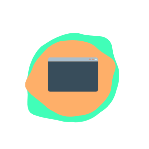

## Hi there, I'm Ebru Oğlakkaya 

## I'm a Learner, Developer, Communicator and Daydreamer

- I'm a Frontend Developer at Webinstats
- I'm trying to learn everything about useful things / or useless _-sometimes-_
- I love everything about js
- I have a bachelor degree in Computer Engineer (Halic University | 2019)
- I have some certificates on web and mobile development
- I'm use React& Native for mobile front-end, .Net tecnologies for back-end development

#### Connect with me:

#### Languages and Tools:

 
 
